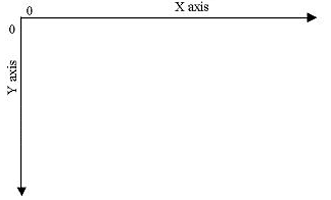

# financial-charts-with-d3js

## Overview

Financial charts let you view the candlestick stocks charts of any stocks such as Apple's (AAPL), Microsoft's (MSFT), or Facebook's (FB) stock charts. It is not limited to these symbols, you may search for any (US) stock symbols that you are interested in. The stock charts data are pulled from Yahoo Finance API and plotted using D3.js.

It is a simple stock chart that is built using a data visualization library, [D3.js](https://github.com/mbostock/d3), that I learned recently.

## Technologies Used

1. [Rails](http://rubyonrails.org/) - Backend
2. [jQuery](http://jquery.com/) - Frontend
3. [D3.js](https://github.com/mbostock/d3) - Frontend

### Rails

I used rails for the backend. I combined rails with Yahoo Finance API to pull the stock price data and feed it to the chart created in D3.js.

## jQuery

This was used to communicate with the backend and feed the data to D3.js.

## D3.js

This is a new technology I picked up a couple days ago to draw the stock chart.

The convention used in D3.js is different from other plotting software such as Matlab. Instead of feeding in the chart with a pair value of (x, y), it uses a concept called [data joining](http://bost.ocks.org/mike/join/) to plot the (x, y) values.

D3.js uses [SVG (Scalable Vector Graphics)](http://www.w3.org/Graphics/SVG) heavily, so I also learned SVG along the way.

One of the tricky parts about D3.js (and SVG) was setting up the y-axis correctly, as the positive y-axis is positioned downward (not upward that we all learned in school). See image below.

## Scope

I took on this project to learn a new technology (D3.js), so there are still a lot of features I have not added in my chart. For examples:

1. Ability to zoom in chart (the zoom feature I incorporated is buggy)
2. Ability to reset zoom
3. Ability to add a trendlines
4. Add all other financial indicators (MACD, RSI, etc.)
5. Add colors for up day and/or down day

See below to get started if you would like to contribute to this project.

## Getting Started

In your terminal, type:

`git clone https://github.com/gVien/financial-charts-with-d3js.git`

After that you need to bundle install the required gems.

`bundle install`

